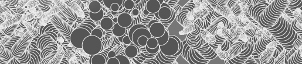
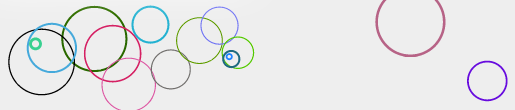
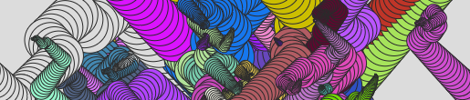

###JS3 is a fast & lightweight JavaScript drawing & animation library modeled after the [Flash ActionScript drawing API](http://en.wikipedia.org/wiki/ActionScript)
****

* [Getting Started](http://js3.braitsch.io/)
* [Gallery & Examples](http://js3.braitsch.io/gallery/honeycomb)
* [More details on my blog](http://http://kitchen.braitsch.io/introducing-js3/)

****

